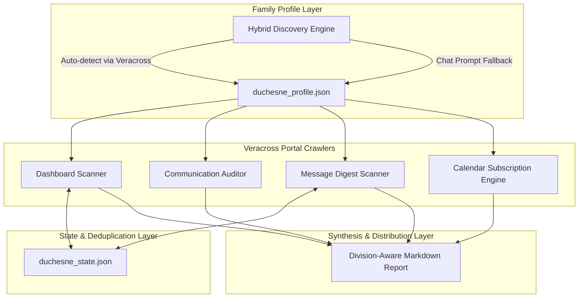

# Duchesne School Assistant: Multi-Division & Veracross Core Design Spec

**Date:** 2026-10-06  
**Status:** Approved  
**Author:** Antigravity & Antigravity  
**Target:** `duchesne-school-assistant` Skill & Portable Agent Package  

---

## 1. Executive Summary & Goals

The `duchesne-school-assistant` is being evolved from a single-child personal automation (PK4 Lower School) into a universal, multi-division school assistant suitable for any Duchesne Academy of the Sacred Heart family.

### Primary Objectives:
1. **Multi-Division & Multi-Child Support:** Support families with one or multiple children across Lower School (PK3–4th), Middle School (5th–8th), and Upper School (9th–12th).
2. **Comprehensive Dashboard Monitoring:** Seamlessly scan and synthesize updates from all Veracross parent dashboards: General Announcements, Lower School, Middle School, Upper School, Athletics, Fine Arts, and Parent Association.
3. **Communication Preferences Audit:** Inspect the parent's "Manage School Communication" settings in Veracross and flag critical misconfigurations (specifically disabled email forwarding for direct faculty/staff messages).
4. **Veracross Messages Digest:** Summarize internal portal messages received over the past 14 days, extracting actionable items, deadlines, and delivery channel status.
5. **Universal Calendar Subscription Engine:** Extract personalized Veracross `webcal://`/`.ics` calendar feeds and provide 1-click subscription links and setup guides for Apple Calendar, Google Calendar, and Microsoft Outlook.
6. **Dual-Mode Portability:** Operate in **Automated Mode** for local agent environments (Antigravity, Gemini Spark, Claude Code) and **Assisted Mode** for web chat interfaces (ChatGPT Plus, Claude.ai, Gemini Advanced).

---

## 2. System Architecture



---

## 3. Detailed Specifications

### Section 1: Profile Architecture & Dynamic Enrollment Discovery

#### 1.1 Schema (`duchesne_profile.json`)
Stored locally at `~/.gemini/antigravity/duchesne_profile.json` (with fallback in the active workspace):
```json
{
  "family_id": "household_12345",
  "children": [
    {
      "student_id": "1001",
      "first_name": "Clara",
      "last_name": "Davis",
      "division": "lower_school",
      "grade": "PK4",
      "homeroom_advisor": "Faculty, Sample",
      "lms": "toddle",
      "toddle_class_id": "116643011487614044"
    }
  ],
  "active_dashboards": [
    "all_school",
    "lower_school",
    "fine_arts",
    "athletics",
    "parent_association"
  ],
  "preferences": {
    "include_lunch_menus": true,
    "include_athletics": true,
    "include_fine_arts": true,
    "auto_audit_communications": true
  }
}
```

#### 1.2 Hybrid Discovery Mechanism
* **Automated Mode:** The agent checks `portals.veracross.com/duchesne/parent`, inspects the "My Children" selector element (`select#student_switcher` or student card list), and extracts:
  * Child full name
  * Enrolled grade level
  * Division association (LS / MS / US)
  * Homeroom or Advisor name
  * Present extracted profile in chat for a single confirmation from the parent.
* **Assisted Mode (Fallback):** If no browser session is active, the assistant asks:
  > *"Which grades and divisions are your children attending at Duchesne (e.g. PK4 in Lower School, 7th in Middle School)?"*
  The response is normalized into `duchesne_profile.json`.

---

### Section 2: Dashboard Scanning & Division-Aware Aggregation

#### 2.1 Route Matrix & Division Filter
The scanner selectively queries only dashboards relevant to enrolled children:
* **All-School (Always scanned):**
  * `/parent`: Head of School Friday Letter (published ~9:00 AM Central on Fridays), school-wide liturgies, security/weather alerts.
  * `/parent/pages/pa-page`: Parent Association events, Extravaganza, volunteering.
* **Lower School (`/parent/pages/ls-page`):** Head of Lower School letter, rolling division calendar, uniform guidelines, special liturgical dress days.
* **Middle School (`/parent/pages/ms-page`):** Head of Middle School letter, advisory topics, class trips, athletic tryouts, testing dates.
* **Upper School (`/parent/pages/us-page`):** Head of Upper School letter, college counseling milestones, standardized testing, retreats, graduation requirements.
* **Athletics (`/parent/pages/athletics`):** Scanned if `include_athletics` is true.
* **Fine Arts (`/parent/pages/fa-page`):** Scanned if `include_fine_arts` is true.
* **Extended Programs (`/parent/pages/ep-page`):** Scanned if child is enrolled in aftercare/enrichment.

#### 2.2 Deduplication & Caching (`duchesne_state.json`)
* Articles and announcements are hashed by `(title + date + snippet)` or assigned their Veracross item ID.
* Stored in `duchesne_state.json` under `processed_announcement_ids`.
* Only new items or items with active future deadlines are highlighted in urgent action items.

---

### Section 3: Communication Preferences Audit & Veracross Messages Digest

#### 3.1 Preferences Audit Logic
* **Target Route:** `https://portals.veracross.com/duchesne/parent/communication_preferences`
* **Inspection Rule:** Check that email delivery is active for:
  1. *Direct Messages from Faculty & Staff*
  2. *Division Newsletters*
  3. *All-School Announcements*
* **High-Priority Alert:** If *Direct Messages from Faculty & Staff* has email disabled:
  > ⚠️ **CRITICAL WARNING:** Email notifications are currently disabled for direct messages from teachers and staff. You will only see teacher messages if you log into the portal. You will NOT receive an email!
  > **Fix:** In Veracross, click your name in the top right > **Manage School Communication** > turn ON **Send an email copy** for faculty messages.

#### 3.2 Messages Digest
* **Target Route:** `https://portals.veracross.com/duchesne/parent/messages`
* **Filter:** Messages received within the last 14 days (or newer than `last_message_timestamp`).
* **Output per message:**
  * Sender Name & Role
  * Date/Time
  * Subject Line
  * 1–2 sentence summary
  * Action Item / Deadline flag (if reply or action is requested)
  * Email delivery status ("Sent via Email" vs "Portal Only")

---

### Section 4: Calendar Subscription Engine

#### 4.1 Token Extraction
* **Target Route:** `https://portals.veracross.com/duchesne/parent/calendar`
* **Extracted Feed URLs:**
  * Personalized Family / Student Schedule Feed: `webcal://portals.veracross.com/duchesne/subscribe/<token>.ics`
  * All-School Calendar Feed
  * Division Feeds (LS, MS, US)
  * Athletics & Fine Arts Feeds

#### 4.2 One-Click Formatter
The assistant generates native subscription links and short 3-step setup guides:
1. **Apple Calendar (Mac / iOS):** Direct `webcal://` link that opens native subscription dialogue.
2. **Google Calendar (Android & Web):** Direct 1-click URL formatted as `https://calendar.google.com/calendar/r?cid=<encoded_feed_url>` + manual "Other calendars > From URL" steps.
3. **Microsoft Outlook (Web & Desktop):** Direct link to `https://outlook.office.com/calendar/addcalendar` + "Subscribe from web" instructions.

---

## 4. Multi-Child Synthesized Digest Format

```markdown
# 🏫 Duchesne Academy Updates — [Date]

### 🚨 Urgent Deadlines & Action Items (All Children)
- [ ] **[All-School]** [Action item with deadline]
- [ ] **[Child A - Grade]** [Action item with deadline]
- [ ] **[Child B - Grade]** [Action item with deadline]

### ⚠️ Communication Preferences Audit
- [Status: Healthy OR Alert regarding disabled email forwarders]

### 📬 Recent Veracross Messages (Past 14 Days)
- **[Sender]** ([Date]) — *[Subject]*: [Summary & Action Required]

### 🏛️ All-School Announcements
- **Head of School Friday Letter:** [Summary & Link]
- **Liturgies & Community:** [Summary]
- **Parent Association (PA):** [Volunteer / Event details]

### 🎒 Lower School ([Child A Name] — [Grade])
- **Division Head Letter:** [Summary]
- **Homeroom Updates:** [Learning focus & reminders]

### 📚 Middle / Upper School ([Child B Name] — [Grade])
- **Division Head Letter:** [Summary]
- **Advisory & Academics:** [Summary]

### 📅 Calendar Subscriptions
- [1-Click Links for Apple, Google, and Outlook]
```

---

## 5. Verification & Testing Strategy

1. **Profile Discovery Test:** Verify `duchesne_profile.json` correctly saves single-child and multi-child families across LS, MS, and US.
2. **Dashboard Selective Query Test:** Ensure Middle School parents only query MS, All-School, and active extracurricular dashboards (no LS noise).
3. **Communication Alert Trigger Test:** Validate that disabling the email forwarder toggle triggers the high-visibility warning banner.
4. **Message Digest Test:** Verify deduplication and 14-day window boundary enforcement.
5. **Calendar Link Test:** Validate that generated Google Calendar `render?cid=` and Apple `webcal://` URLs format valid encoded targets.
