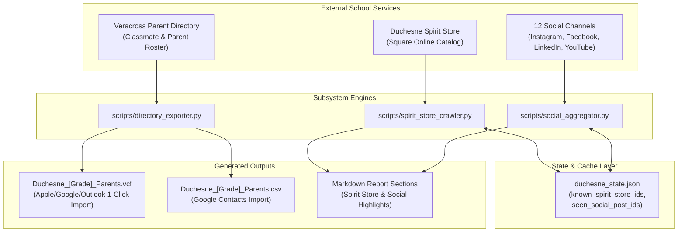

# Duchesne School Assistant: Store, Contacts & Social Media Extensions Design Spec

**Date:** 2026-10-06  
**Status:** Approved  
**Author:** Antigravity  
**Target:** `duchesne-school-assistant` Skill & Portable Agent Package (Sub-Project 2)  

---

## 1. Overview & Objectives

Sub-Project 2 expands the Duchesne School Assistant beyond portal communications to cover school commerce, community directory exports, and unified social media engagement.

### Key Goals:
1. **Spirit Store Inventory Crawler:** Continuously monitor `https://duchesnespiritstore.square.site/` to alert parents to new merchandise arrivals and curate seasonal/division-relevant featured picks.
2. **Directory & Contact Exporter:** Scrape and parse the Veracross parent directory for a family's grade level(s) and export individual parent contact cards into both standard **vCard (`.vcf`)** (compatible with Apple Contacts, Google Contacts, and Outlook) and **Google Contacts CSV**.
3. **12-Channel Social Media Aggregator & Deduplicator:** Monitor 12 official Duchesne social media channels across Instagram, Facebook, LinkedIn, and YouTube, normalize posts, deduplicate cross-posted announcements using token similarity, and output consolidated stories with multi-platform links.
4. **Resilience & Fault Isolation:** Ensure failures or rate-limits on external services (e.g. Instagram) never block core portal digests or directory exports.

---

## 2. System Architecture



---

## 3. Subsystem Specifications

### Section 1: Spirit Store Crawler & Inventory Alerts

#### 1.1 Ingestion Target
* **Store URL:** `https://duchesnespiritstore.square.site/`
* **Parsing Mechanism:** Public HTTP fetch parsing `window.__DYNAMIC_BOOTSTRAP__` JSON payload (with regex HTML fallback).

#### 1.2 Data Schema (`StoreItem`)
```python
@dataclass
class StoreItem:
    id: str
    title: str
    price: str
    category: str
    product_url: str
    image_url: str = ""
    is_new_arrival: bool = False
```

#### 1.3 State Tracking (`duchesne_state.json`)
* Stored list of seen product IDs: `"known_spirit_store_ids": [str, ...]`.
* If an item ID is not in `known_spirit_store_ids`, it is marked as `is_new_arrival = True`.
* After scanning, newly found IDs are committed to `duchesne_state.json`.

#### 1.4 Featured Item Logic
* **Fall / Winter (Oct – Feb):** Prioritizes keywords `fleece`, `jacket`, `sweatshirt`, `hoodie`, `outerwear`, `cardigan`.
* **Spring (Mar – May):** Prioritizes keywords `t-shirt`, `spirit shirt`, `cap`, `polo`, `shorts`.
* Selects 2–3 seasonal items to display alongside new arrivals.

---

## Section 2: Veracross Directory Crawler & Contact Exporter

#### 2.1 Extraction Target
* **Portal Route:** `https://portals.veracross.com/duchesne/parent/directory`
* **Filtering:** Automatically filters by the child's enrolled grade level(s) (e.g. `PK4`, `7th`, `10th`).

#### 2.2 Data Schema (`ParentContact`)
```python
@dataclass
class ParentContact:
    first_name: str
    last_name: str
    email: str
    phone: str
    child_name: str
    child_grade: str
    address: str = ""
```

#### 2.3 Output Formats
1. **vCard 3.0 (`.vcf` - RFC 6350):**
   ```vcard
   BEGIN:VCARD
   VERSION:3.0
   FN:Jane Doe
   N:Doe;Jane;;;
   EMAIL;TYPE=INTERNET,HOME:jane.doe@example.com
   TEL;TYPE=CELL:(713) 555-0123
   ORG:Duchesne Academy of the Sacred Heart
   TITLE:Parent of Clara Davis (PK4)
   NOTE:Student: Clara Davis | Grade: PK4 | Duchesne Academy Parent Directory
   ADR;TYPE=HOME:;;10202 Memorial Dr;Houston;TX;77024;USA
   END:VCARD
   ```
2. **Google Contacts CSV:**
   - Headers: `Name,Given Name,Family Name,E-mail 1 - Type,E-mail 1 - Value,Phone 1 - Type,Phone 1 - Value,Organization 1 - Name,Organization 1 - Title,Notes,Address 1 - Formatted`

---

### Section 3: 12-Channel Social Media Aggregator & Deduplication

#### 3.1 Registered Channels
1. `https://www.instagram.com/duchesnehouston` (Main All-School Instagram)
2. `https://www.instagram.com/duchesneathletics` (Athletics Instagram)
3. `https://www.instagram.com/chargergirlsdance/` (Charger Girls Dance Team)
4. `https://www.instagram.com/duchesne_arts/` (Fine Arts Instagram)
5. `https://www.instagram.com/duchesneupperschool` (Upper School Instagram)
6. `https://www.instagram.com/duchesneadmissions/` (Admissions Instagram)
7. `https://www.instagram.com/duchesnealumnae` (Alumnae Instagram)
8. `https://www.linkedin.com/school/duchesne-academy-of-the-sacred-heart/` (Official LinkedIn)
9. `https://www.facebook.com/DuchesneAcademyHouston` (Main Facebook Page)
10. `https://www.facebook.com/profile.php?id=100079069373448` (Duchesne Athletics & Campus Life Facebook)
11. `https://www.facebook.com/DuchesneHoustonAlums` (Alumnae Facebook)
12. `https://www.youtube.com/@duchesneacademyofthesacred1409` (YouTube Channel)

#### 3.2 Data Schema
```python
@dataclass
class SocialPost:
    channel: str
    channel_name: str
    url: str
    caption: str
    timestamp: str

@dataclass
class UnifiedSocialStory:
    story_id: str
    headline: str
    summary: str
    timestamp: str
    source_links: Dict[str, str] # e.g. {"Instagram (@duchesneathletics)": "https://...", "Facebook": "https://..."}
```

#### 3.3 Deduplication Engine
* Normalizes caption text by lowercasing, stripping URLs, hashtags (`#duchesnehouston`, etc.), and punctuation.
* Calculates word token Jaccard similarity:
  $$\text{Jaccard}(A, B) = \frac{|A \cap B|}{|A \cup B|}$$
* Any pair of posts with similarity $\ge 0.70$ are merged into a single `UnifiedSocialStory` combining all source links.

---

## 4. Unified CLI & Scanner Integration

The `scripts/veracross_scanner.py` CLI is extended with new actions:
* `--action store`: Crawls Spirit Store, prints new arrivals and featured items.
* `--action contacts --grade [GRADE]`: Exports classmate parent contacts to `.vcf` and `.csv`.
* `--action social`: Fetches and prints unified social media stories.
* `--action full-scan`: Includes store picks and social highlights in the comprehensive family digest.

---

## 5. Verification & Testing Strategy

1. **Store Crawler Tests:** Unit tests verifying catalog JSON parsing, new arrival state detection, seasonal featured item selection, and empty/error fallbacks.
2. **Directory Exporter Tests:** Unit tests validating vCard 3.0 generation, Google Contacts CSV structure, proper escaping of commas/special characters, and grade filtering.
3. **Social Aggregator Tests:** Unit tests validating caption normalization, token Jaccard similarity calculation, multi-channel link merging, and resilient error handling for blocked channels.
4. **Integration Test:** Executing `scripts/veracross_scanner.py --action full-scan` with mocked payloads ensuring clean output without errors.
